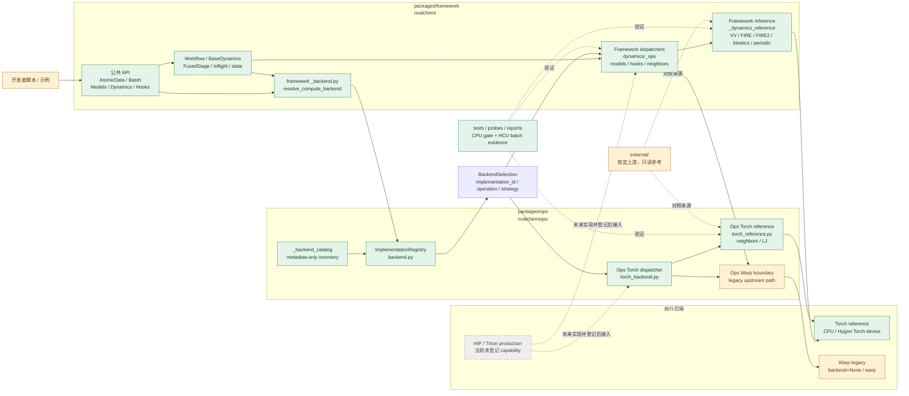
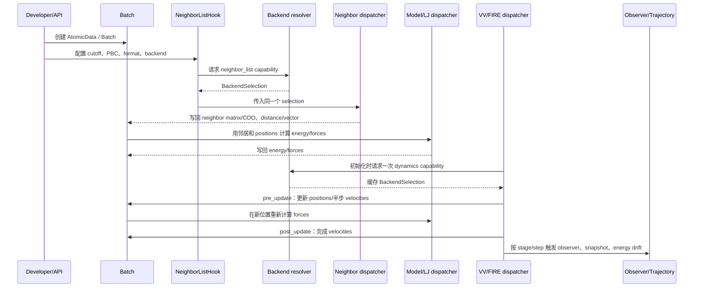
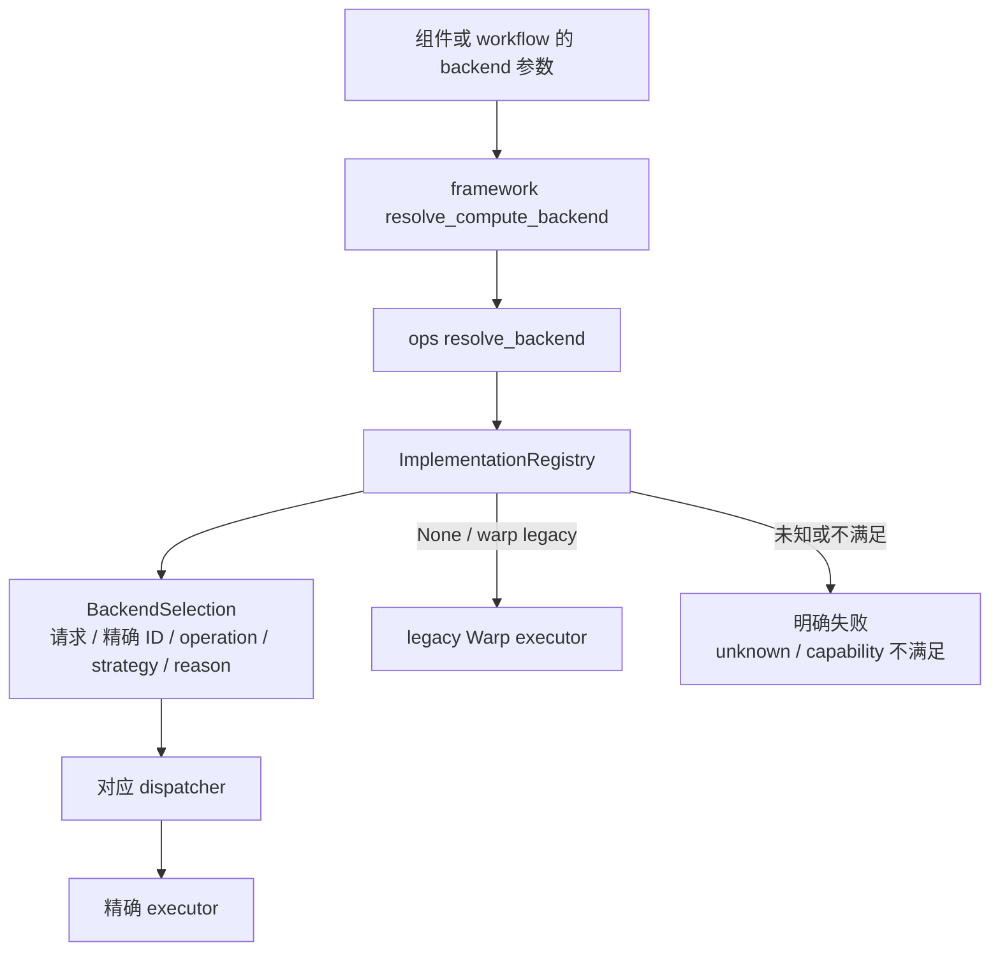

# 开发者系统结构图

本文只解释当前基础开发版本的代码边界和调用关系，面向准备修改代码的开发者。它不是
完整产品架构承诺；实际支持范围以 `docs/STATUS.md` 和 `reports/` 为准。

## 1. 一张图看懂当前系统



读图时抓住四个原则：

1. `framework` 负责用户可见工作流、Batch、模型、Dynamics 和 Hook；`ops` 负责底层算子
   registry、Torch dispatcher 和邻居/LJ reference。
2. 后端选择由 `ops.backend` 集中管理。framework 通过 `resolve_compute_backend` 请求，
   得到 `BackendSelection` 后向下传递。
3. 当前已经接通单次 selection 的主要路径是 neighbors、LJ、固定晶胞 VV/FIRE/FIRE2、
   periodic、kinetics 和 observer。dispatcher 不应再次解析同一 request。
4. `backend=None` 仍指向上游 Warp legacy。显式 `backend="torch_reference"` 才进入当前
   Torch reference；Triton/HIP 只有在有真实能力和数值证据后才能画成可用路径。

## 2. 一条 golden path 如何流动

以“Batch → 邻居 → LJ/MACE → 固定晶胞 Dynamics → observer”为例：



注意：图中的“写回”遵守各算子的 mutation/alias contract；不是说所有模型都修改同一批
字段。FusedStage 和 inflight 会在这条流程外层管理 stage、体系退出/补位和 state 对齐。

## 3. 后端选择到底在哪里发生



当前选择语义：

| 请求 | 当前含义 |
|---|---|
| `None` | 上游 legacy Warp；不因 Hygon 设备可见或 Warp 缺失而偷偷改变 |
| `"warp"` | legacy Warp selection |
| `"torch_reference"` | 由 registry 按 operation/strategy/capability 选择 Torch reference |
| `"auto"` | 目前只在已有 capability 范围内选择；没有 M2 profile 时不负责全 pipeline 规划 |
| `"triton"` / `"hip"` | 当前生产 capability 未登记，不能当作已可用后端 |
| 精确 implementation ID | 只允许该登记项满足契约，否则明确失败 |

一个容易混淆的点：`BackendSelection` 是一次具体的 operation 选择，不是“本次运行全局都用
这个 backend”。neighbors、LJ、integrator、observer 可以有不同 operation selection；
后续 M2 才会处理整个 pipeline 的 profile 和冻结 plan。

## 4. 代码应该放在哪里

| 你要做的事 | 首先查看/修改的位置 | 说明 |
|---|---|---|
| 新增 Torch reference 算法 | `packages/framework/nvalchemi/_dynamics_reference/` 或 `packages/ops/nvalchemiops/torch_reference.py` | 先看同类已完成 reference；保持设备内 Torch，不导入 Warp |
| 修改公共 Dynamics/Model/Hook | `packages/framework/nvalchemi/` | 保持上游 API 和 Batch/state 生命周期 |
| 修改 framework backend 接线 | `packages/framework/nvalchemi/_backend.py`、对应 `dynamics/_ops` 或模型/hook 文件 | framework 解析一次并传 selection |
| 登记实现能力 | `packages/ops/nvalchemiops/_backend_catalog/` | 只写 `Implementation` metadata 和 executor 字符串 |
| 修改 registry 语义 | `packages/ops/nvalchemiops/backend.py` | 保持 public API、legacy/default 和未知请求错误 |
| 新增生产 Triton/HIP | `packages/ops` 对应算子族和构建入口 | 先有 reference、契约、HCU 数值和性能证据 |
| 新增测试 | 对应 package 的 test，当前跨包行为放 `packages/framework/test/compatibility/` | framework/ops pytest 分进程运行；根 `tests/` 是未来集中测试的规划入口 |
| 环境/数值探针 | `probes/` | 原始输出进 `artifacts/`，摘要进 `reports/` |
| 查看上游 | `external/` | 只读；版本以 `docs/UPSTREAM_LOCK.yaml` 为准 |

不要把同一个算法同时复制到 framework、ops 和 probes 三份。probe 是验证入口，不是第三份
生产实现。

## 5. 当前已经稳定的边界

### 已有 Torch reference golden paths

- neighbors：dense periodic/no-PBC full-list；no-PBC cell-list 是显式 strategy；
- LJ：energy/force 以及有限的二阶路径；
- fixed-cell dynamics：VV、FIRE、FIRE2、kinetics；
- periodic：位置 wrap；
- observer：segmented reduce、Logging/energy-drift 窄 slice；
- Batch、异构体系、Hook lifecycle、部分 state/inflight 行为。

这些是开发基线，不等于完整生产模拟能力。尤其不能从 reference 通过推导出周期 half-list、
完整 Langevin/NHC/NPT、变胞 stress、DomainParallel 或 Triton/HIP production 已完成。

### 当前仍在边界外的内容

- PlatformFingerprint、BackendProfile、Frozen BackendPlan（M2）；
- periodic cell-list、NVTLangevin、NVT Nose-Hoover、NPT/NPH；
- 生产 Triton/HIP neighbor/LJ/MLIP kernel；
- 完整 checkpoint/restart、长轨迹性能门槛、单体系多卡域分解。

开发者要做上述任务时，应按独立 operation 建立契约，不要顺手修改全局 backend 语义。

## 6. 如何验证你的改动

最小循环：

```text
读本图和 STATUS
  → 找锁定上游符号
  → 写 operation contract
  → 写 CPU Torch reference 与最小测试
  → 登记 registry capability
  → 接 framework dispatcher，传递同一个 BackendSelection
  → 运行 scripts/check_cpu_reference.sh
  → 在分配的 HCU 上运行对应 probe
  → 更新 STATUS、FEATURE_COMPATIBILITY、report
```

CPU gate：

```bash
scripts/check_cpu_reference.sh
```

HCU batch 必须显式指定已分配设备：

```bash
HIP_VISIBLE_DEVICES=0 scripts/check_hcu_reference_smoke.sh
```

没有真实 HCU 运行记录时，只能报告 CPU verified 或 HCU pending。HCU 失败后不能自动切到
CPU 并报告成功。

## 7. 阅读顺序建议

新开发者建议按下面顺序浏览源码：

1. `packages/framework/nvalchemi/data/`：理解 `AtomicData`、`Batch` 和体系边界；
2. `packages/framework/nvalchemi/neighbors.py` 与 `hooks/neighbor_list.py`：理解邻居如何写回；
3. `packages/ops/nvalchemiops/backend.py`：理解 registry 和 selection；
4. `packages/framework/nvalchemi/dynamics/_ops/velocity_verlet.py`：理解 dispatcher 模式；
5. `packages/framework/nvalchemi/_dynamics_reference/velocity_verlet.py`：理解 Torch reference；
6. `packages/framework/nvalchemi/dynamics/integrators/nve.py`：理解 workflow 如何缓存 selection；
7. `docs/TUTORIAL_TORCH_INTEGRATOR_FOR_BEGINNERS.md`：按完整教程练习一个新积分器。

如果源码与本图或历史文档不一致，以锁定源码、最新 `STATUS.md` 和真实测试报告为准；发现
差异后应在下一次交接中修正本图。
